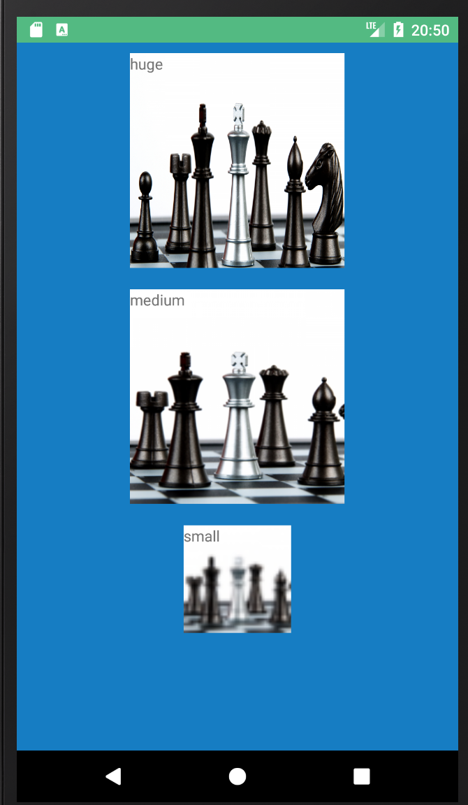

# android res image cover issue

> App to demo a bug with images from res on Android.

## Result



## Usage

```bash
# Install dependencies
npm install

# Build for production
tns build <platform> --bundle

# Build, watch for changes and debug the application
tns debug <platform> --bundle

# Build, watch for changes and run the application
tns run <platform> --bundle
```
